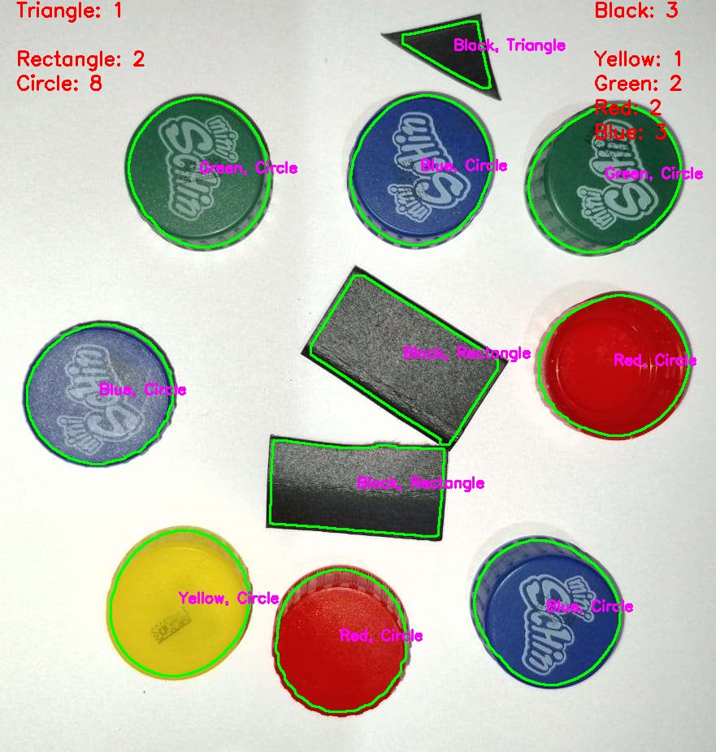

# Object Classification (PDI)

This repository contains a project for classifying objects in images, distinguishing them by shape and color. The code implements a class called ObjectDetector that processes images to detect, classify, and count objects based on their shapes and colors. The process includes shadow removal, image segmentation, contour detection, and classification of objects by shape (triangle, square, rectangle, circle) and color. Note: parameters need to be adjusted for each image for better identification.

## Screenshot

<div align="center">
  
</div>

## How to Run

1. Make sure all dependencies are installed:
    ```sh
    pip install -r .\src\requirements.txt
    ```

2. Run the script:
    ```sh
    python .\src\main.py
    ```

## Contribution

Feel free to open issues or submit pull requests. All contributions are welcome!

## License

This project is licensed under the MIT License - see the [LICENSE](LICENSE) file for more details.
